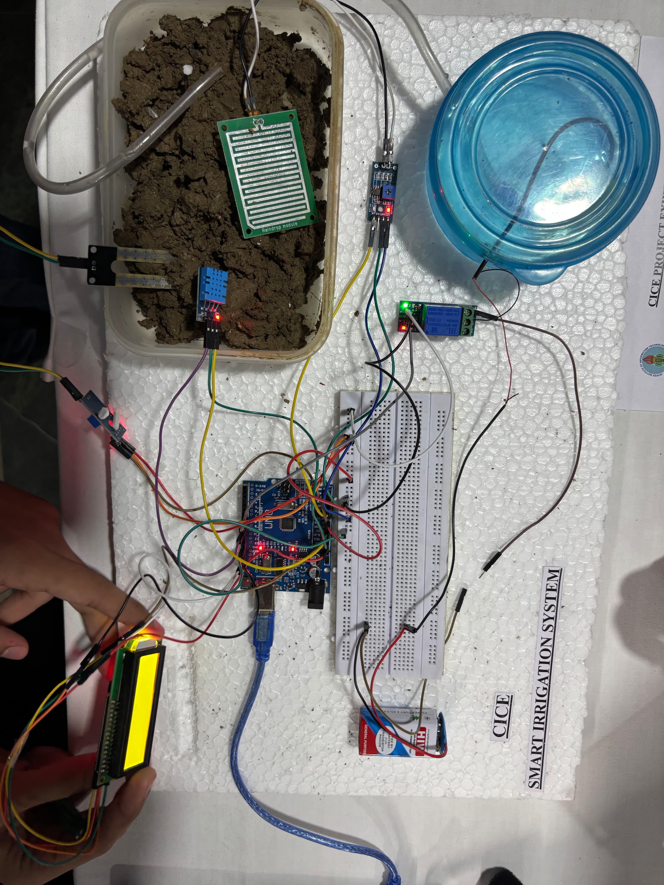

# **IrrigateX**

### Sensor-Based Automated Irrigation System

**IrrigateX** is a microcontroller-based irrigation system that automates water pump control using **soil moisture**, **rain detection**, and **environmental data**.
The system reduces manual intervention and prevents unnecessary irrigation through **threshold-based decision logic**.

---

## **Problem Statement**

Manual irrigation often leads to:

* Water wastage
* Over-watering during rainfall
* Lack of real-time soil awareness

---

## **Solution**

IrrigateX continuously monitors field conditions and **automatically controls irrigation** based on sensor inputs, ensuring water is supplied **only when required**.

---

## **Core Features**

* Automated pump control using relay
* Soil moisture-based irrigation logic
* Rain-aware pump shutdown
* Temperature & humidity monitoring (DHT11)
* Real-time data display on I2C LCD

## **Proof of Concept (PoC)**

This repository includes a **working Proof of Concept** demonstrating the complete hardware setup and system operation.

* The PoC image shows the **Arduino board, sensors, relay module, LCD, and wiring**
* Confirms successful **end-to-end integration** of hardware and software
* Validates real-world functionality beyond simulation

## System Logic
1. Read soil moisture level
2. Check rain sensor status
3. If soil moisture is **below threshold** and **no rain is detected** → Pump ON
4. If soil moisture reaches the **defined threshold** → Pump OFF

---

## **Hardware Used**

* Arduino (ATmega-based)
* DHT11 Temperature & Humidity Sensor
* Soil Moisture Sensor
* Rain Sensor
* Relay Module
* Water Pump
* 20×4 I2C LCD

---

## **Software Stack**

* **Language:** Arduino C++
* **IDE:** Arduino IDE / VS Code
* **Libraries:** DHT, Wire, LiquidCrystal_I2C

---

## **Pin Configuration**

| Component            | Pin        |
| -------------------- | ---------- |
| Relay                | D8         |
| DHT11                | D9         |
| Soil Moisture Sensor | A0         |
| Rain Sensor          | A1         |
| LCD                  | I2C (0x27) |

---

## **What This Project Demonstrates**

* Embedded C++ programming
* Sensor interfacing
* Conditional control logic
* Hardware–software integration
* Real-world automation problem solving

---

## **Limitations**

* Threshold-based logic (no adaptive learning)
* Local system (no IoT / remote monitoring)

---

## **Potential Improvements**

* IoT dashboard integration
* Data logging for irrigation analysis
* Crop-specific moisture calibration

---

## **Use Case**

* Academic projects
* Smart farming prototypes
* Home gardens / small farms

---

## **Author**

Developed as a hands-on embedded systems project focusing on **automation, reliability, and practical design**.

